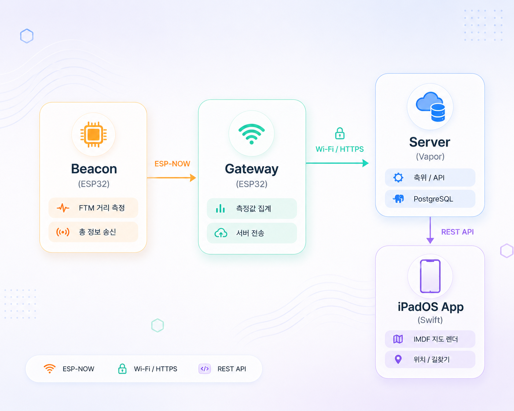

# FindU

> Apple Developer Academy @ POSTECH — Challenge 6

대형 실내 공간에서 **"내가 지금 어디에 있는지"** 와 **"가고 싶은 곳까지 어떻게 가는지"** 를 알려주는 실내 측위 · 길찾기 서비스입니다.
ESP32 기반 BLE 비콘과 FTM(Fine Timing Measurement)으로 좌표를 추정하고, Apple IMDF 포맷의 실내 지도 위에 사용자의 위치와 경로를 그려줍니다.

| 문서 | 위치 |
|------|------|
| 📘 기획 문서 | [`FindU 기획 문서_Final.pdf`](./FindU%20기획%20문서_Final.pdf) |
| 📗 기술 문서 | [`FindU 기술 문서_Final.pdf`](./FindU%20기술%20문서_Final.pdf) |

---

## 🏥 에스포항병원 협업 및 실증


본 프로젝트는 **에스포항병원(Pohang Stroke and Spine Hospital)**과의 협업을 통해 실제 병원 실내 환경에서 실증 및 테스트를 진행하였습니다.
- **실내 측위 테스트 베드 제공**: 에스포항병원 내의 실제 병동 및 로비 공간을 테스트 베드로 활용하여, 복잡한 실내 장애물 환경에서의 ESP32 비콘 배치 및 FTM(Fine Timing Measurement) 거리 측정의 정확도를 실증하였습니다.
- **실제 도면 기반 IMDF 구축**: 에스포항병원의 공식 실내 도면 데이터를 제공받아 Apple IMDF(Indoor Mapping Data Format) 모델을 구축하고, 실제 병원 내부 구조에 맞춘 실내 지도 렌더링 및 모바일 길찾기 서비스를 구현하였습니다.
- **사용자 시나리오 검증**: 병원 방문객(환자, 보호자 등)이 직면하는 길 찾기의 어려움을 해결하기 위한 현실적인 요구사항 분석 및 사용자 시나리오 구체화에 협력하였습니다.

---

## 🧭 시스템 개요



- **비콘 → 게이트웨이**: ESP-NOW + FTM, 칼만 필터로 거리 노이즈 보정
- **게이트웨이 → 서버**: 수집된 거리값을 주기적으로 업로드
- **서버 → iPadOS**: 측위 결과, 사용자, 장소(POI), 경로 데이터 제공
- **iPadOS 앱**: Apple IMDF로 실내 지도를 렌더링하고 현재 위치 · 경로를 시각화

---

## 📂 저장소 구조

```
AppleAcademyChallenge6/
├── FindU_FE/                  # iPadOS 앱 (Findew)
├── FindU_BE/                  # 서버 (Swift Vapor + PostgreSQL)
├── FindU_Embedded/            # ESP32 펌웨어 (Beacon / Gateway)
├── FindU_IMDF(IndoorMap)/     # IMDF 실내 지도 디코더 (Swift)
├── FindU 기획 문서_Final.pdf
└── FindU 기술 문서_Final.pdf
```

각 모듈의 상세 실행 방법과 컨벤션은 하위 README를 참고해주세요.

| 모듈 | 설명 | 주요 기술 | README |
|------|------|----------|--------|
| **FindU_FE** | iPadOS 클라이언트 앱 (`Findew`) | Swift, SwiftUI/UIKit, Moya, Combine | [바로가기](./FindU_FE/README.md) |
| **FindU_BE** | 측위 데이터 · 사용자 · POI API 서버 | Swift Vapor 4, Fluent, PostgreSQL, JWT, AWS S3(Soto), OpenAPI | [바로가기](./FindU_BE/README.md) |
| **FindU_Embedded** | 실내 측위용 비콘 / 게이트웨이 펌웨어 | ESP32, ESP-IDF, ESP-NOW, FTM, Kalman Filter | [바로가기](./FindU_Embedded/README.md) |
| **FindU_IMDF** | Apple IMDF(Indoor Mapping Data Format) 파서 | Swift, GeoJSON, MapKit | (모듈 코드 참고) |

---

## 🛠 기술 스택 한눈에 보기

### iPadOS (FindU_FE)
- Swift 6 / Xcode
- MVVM + Clean Architecture
- Moya + Combine (네트워크)
- MapKit + IMDF (실내 지도)

### Server (FindU_BE)
- Swift 6, Vapor 4.115+
- Fluent ORM + PostgreSQL
- JWT 인증
- Soto (AWS S3)
- VaporToOpenAPI (Swagger 문서)
- Docker / docker-compose

### Embedded (FindU_Embedded)
- ESP32 (Beacon, Gateway)
- ESP-IDF, Embedded Swift
- ESP-NOW, Wi-Fi FTM
- Kalman Filter

### Indoor Map (FindU_IMDF)
- Apple IMDF 1.0
- Venue / Building / Level / Unit / Amenity 모델
- Swift Decodable 기반 디코더

---

## 🚀 빠른 시작

각 모듈은 독립적으로 빌드 · 실행됩니다. 전체 스택을 로컬에서 돌리려면 아래 순서를 권장합니다.

```bash
# 1. 서버 (Docker 환경)
cd FindU_BE
docker-compose up -d                  # PostgreSQL + Vapor 서버 기동
# 자세한 환경변수는 FindU_BE/.env.example 참고

# 2. ESP32 펌웨어 (Beacon / Gateway)
cd ../FindU_Embedded
# beacon, gateway 각각 빌드 & 플래시
#   자세한 내용은 FindU_Embedded/README.md 참고

# 3. iPadOS 앱
cd ../FindU_FE
open Findew/Findew.xcodeproj          # Xcode 에서 실행
```

> ESP32 디바이스가 없어도 iPadOS 앱 단독 실행은 가능합니다. 서버의 mock endpoint를 이용해 IMDF 지도 / 더미 위치를 확인할 수 있습니다.

---

## 🔖 브랜치 · 커밋 컨벤션

모든 모듈은 동일한 컨벤션을 따릅니다 (각 서브 README의 컨벤션 섹션 참고).

- **브랜치**: `main` / `develop` / `feat/*` / `refac/*` / `fix/*` / `hotfix/*` / `chore/*` / `design/*`
- **커밋 / PR 제목**: `[태그] 설명` — 예) `✨ [Feat] 실내 경로 탐색 구현`
- **태그**: `Feat` · `Fix` · `Refactor` · `Style` · `Docs` · `Test` · `Chore` · `Design` · `Hotfix` · `CI/CD`

---

## 📚 기술 블로그 및 개발 기록

프로젝트 개발 과정에서 탐구한 기술적 고민과 구현 과정을 기록한 블로그 포스트입니다.

### 🔌 Embedded (Embedded Swift)
ESP32 환경에서 **Embedded Swift**를 적용하며 분석하고 구현한 과정을 담은 연재 글입니다.
- [[Embedded Swift] #1 Embedded Swift란 무엇인가?](https://velog.io/@kdm0215/embeddedSwift1)
- [[Embedded Swift] #2 ESP32 환경 세팅 및 동작 확인](https://velog.io/@kdm0215/SwiftEmbedded2)
- [[Embedded Swift] #3 Embedded Swift로 LED 제어하기](https://velog.io/@kdm0215/EmbeddedSwift3)
- [[Embedded Swift] #4 Embedded Swift로 WiFi 연결하기](https://velog.io/@kdm0215/EmbeddedSwift4)
- [[Embedded Swift] #5 Embedded Swift로 FTM 거리 측정 구현](https://velog.io/@kdm0215/EmbeddedSwift5)
- [[Embedded Swift] #6 Embedded Swift 적용 회고 및 요약](https://velog.io/@kdm0215/EmbeddedSwift6)

### 🖥 Server (Swift Vapor)
- [[Vapor] Trilateration Looked Perfect on Paper; Here's Why It Broke in Production](https://medium.com/@euijjang97/trilateration-looked-perfect-on-paper-heres-why-it-broke-in-production-f4a97072aec2)
- [[Vapor] From Trilateration to Weighted Centroid: Choosing Robustness Over Precision](https://medium.com/@euijjang97/from-trilateration-to-weighted-centroid-choosing-robustness-over-precision-1d7b4b4aaecb)

---

## 👥 Team

> ADA6 — FindU Team
> Apple Developer Academy @ POSTECH, Challenge 6

| Role | Name | Nickname | GitHub | Blog | Instagram |
|------|------|----------|--------|------|-----------|
| App(SwiftUI) | 정의찬 | 제옹 | [JEONG-J](https://github.com/JEONG-J) | [Je Ong](https://medium.com/@euijjang97) | [@eui_chan.97](https://www.instagram.com/eui_chan.97/) |
| App(SwiftUI) | 전가혜 | 카야 | [gahyejeon](https://github.com/gahyejeon) | x | [@jxxnxaxxe](https://www.instagram.com/jxxnxaxxe/) |
| Server(Swift Vapor) | 정의찬 | 제옹 | [JEONG-J](https://github.com/JEONG-J) | [Je Ong](https://medium.com/@euijjang97) | [@eui_chan.97](https://www.instagram.com/eui_chan.97/) |
| Embedded(Swift Embedded) | 김동민 | 원 | [GthingkingG](https://github.com/GthingkingG) | [One blog](https://velog.io/@kdm0215) | [@thing_k01](https://www.instagram.com/thing_k01/) |
| Indoor Map(IMDF) | 진아현 | 앤 | [akeroroh](https://github.com/akeroroh) | x | [@ja___h___aj](https://www.instagram.com/ja___h___aj/) |
| Design | 신유하 | 유하 | x | x | x |
| PM | 김무성 | 루카 | [Joshuuakeem](https://github.com/Joshuuakeem) | x | [@moorrs](https://www.instagram.com/moorrs/) |

---

## 📄 License

This project is licensed under the MIT License. See each module's `LICENSE` file for details.
